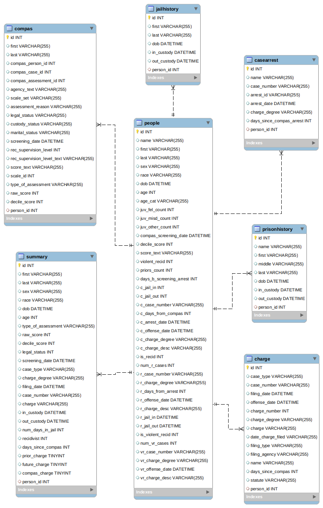

Importamos las librerías necesarias. Si hace falta, hay que instalarlas descomentando la línea necesaria.
```{r}
# install.packages("DBI")
# install.packages("RSQLite")

library(DBI)
library(RSQLite)
```

Escribimos la ubicación del archivo compas.db
Utilizamos los drivers instalados de SQLite para poder pasar el archivo a un data.frame que puede ser manipulado por R.
```{r}
filename <- "compas.db"
sqlite.driver <- dbDriver("SQLite")
db <- dbConnect(sqlite.driver,
                dbname = filename)
```

El objeto db contiene las 7 tablas que pertenecen a compas.
Para obtener un dataframe con alguna de las tablas, vasta con descomentar la linea que lee una tabla.

```{r}
# dbListTables(db)
# >>> "people"  "casearrest"  "charge"  "compas"  "jailhistory" "prisonhistory" "summary"

people <- dbReadTable(db,"people")
casearrest <- dbReadTable(db,"casearrest")
charge <- dbReadTable(db,"charge")
compas <- dbReadTable(db,"compas")
jailhistory <- dbReadTable(db,"jailhistory")
prisonhistory <- dbReadTable(db,"prisonhistory")
summary <- dbReadTable(db,"summary")
```
Vemos en el siguiente diagrama que todas las tablas poseen una única llave primaria que es el id mientras que posee una única llave foránea, el id de una persona. Mientras que la tabla people representa a una de estas, siendo su única llave primaria su id.



```{r}
str(people)
```

**people** -> Una entidad persona. Es la tabla principal que almacena todos los datos de un condenado, tal como su sexo, edad, raza, etc... y con la que se trabajará en mayor medida.


```{r}
str(casearrest)
```

**casearrest** -> EL caso de arresto, se repiten personas que se diferencian por días de arresto y grado del cargo principalmente.

```{r}
str(charge)
```

**charge** -> Especifica el cargo que se le acusa a una persona y otros datos.


```{r}
str(compas)
```

**compas** -> Es la puntuación compas que se le asigna a una persona. Generalmente se presentan las tres puntuaciones para cada individuo (Riesgo de reincidencia con y sin violencia y riesgo de no acudir a la citación).

```{r}
str(jailhistory)
```
**jailhistory** -> Esta tabla guarda el historial de arresto en custodia????? de cada persona. Fecha y hora de cuando sale y entra.

```{r}
str(prisonhistory)
```

**prisonhistory** -> Esta tabla guarda el historial de arresto con prisión?????? de cada persona. Fecha y hora de cuando sale y entra.

```{r}
str(summary)
```

**summary** -> Ni idea :(